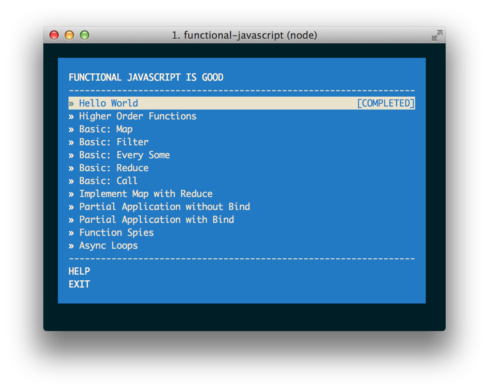

# functional-javascript
### Learning fundamental functional programming features of Javascript.

#### No libraries required (i.e. no underscore), just ES5.
I am following this workshop, It's amazing(https://github.com/timoxley/functional-javascript-workshop).
## Installation & Update

```
$ npm install -g functional-javascript-workshop@latest
```

## Usage Instructions

#### 1. Selecting a problem to work on

Once the workshop is installed, run `functional-javascript-workshop` to print a menu
where you can select a problem to work on.

```
$ functional-javascript-workshop
```

